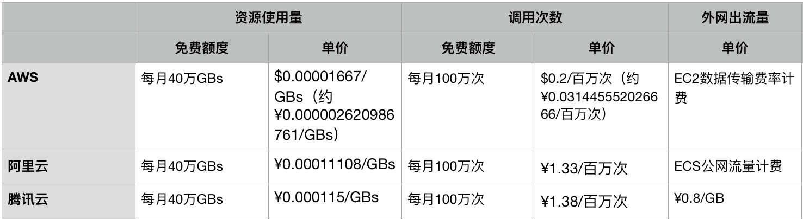

# 无服务器云函数服务计费方式

[TOC]

##腾讯云

账单由以下部分组成：

- 资源使用费用
- 调用次数费用
- 外网出流量费用（可选）


###资源使用费用

```
资源使用费用 = （资源使用量 - 免费资源额度） X 资源使用单价
```

**免费额度**：每月40万GBs

**资源使用单价**：0.000115 元/GBs

**资源使用量GBs**

资源使用量 = 函数配置内存 X 运行计费时长

用户资源使用量，是由函数配置内存，乘以函数运行时的计费时长得出，其中配置内存转换为 GB 单位，计费时长由毫秒（ms）转换为秒（s）单位，因此，资源使用量的计算单位为 **GBs**（GB-秒）。

例如，配置为 256MB 的函数，单次运行了 1760 ms，计费时长为 1800 ms，则单次运行的资源使用量为 (256/1024)*(1800/1000) = 0.45 GBs，超出免费额度的时候为0.00005175元，一百万次调用费用为51元。

针对函数的每次运行，均会计算资源使用量，并按月汇总求和，作为当月的资源使用量。


### 调用次数费用

**调用次数费用** = （**函数调用量** - **免费调用额度**） X **调用次数单价**

函数的每次触发执行，都记为一次调用，并按月汇总求和，并以**百万次**为单位进行计算费用。

**免费额度**：每月100万次

**调用次数单价**

**调用次数单价为：1.38元/百万次**


### 外网出流量费用

**外网出流量费用** = **外网出流量** X **流量单价**

**流量单价为：0.8元/GB**


## 阿里云

调用次数：每月前100万次免费，单价1.33元/百万次

执行时间：每月前40万GBs免费，单价0.00011108元/GBs

公网流量费用：不同速率免费额度不一样。见https://help.aliyun.com/document_detail/54301.html?spm=a2c4g.11186623.6.545.KEta1j


## AWS

调用次数：每月前100万次免费，单价$0.0000002/次，约合¥0.031445552026666元/百万次（汇率1美元=6.3602人名币）

执行时间：每月前40万GBs免费，单价$0.00001667/Gbs，约合¥0.000002620986761元/GBs

公网流量费用：不同速率免费额度不一样。见[https://amazonaws-china.com/cn/lambda/pricing/](https://amazonaws-china.com/cn/lambda/pricing/)


## 价格对比

