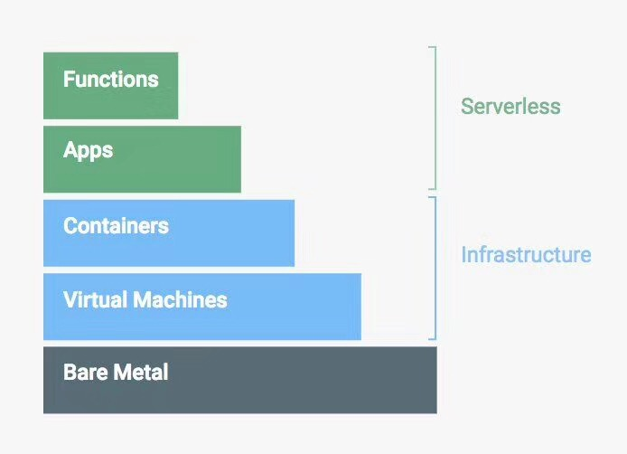

## 无服务器云函数

[TOC]


### 无服务器云函数服务产品

- [AWS Lambda](https://amazonaws-china.com/cn/lambda/?nc2=h_m1)
- [谷歌云 Google Cloud Functions](https://console.cloud.google.com/freetrial?_ga=2.137359157.-426058469.1525414047)
- [微软 Microsoft Azure Functions](https://azure.microsoft.com/en-us/services/functions/)
- [阿里云 函数计算](https://www.aliyun.com/product/fc?spm=5176.173847.765261.276.WWy95u)
- [腾讯云 无服务器云函数SCF](https://cloud.tencent.com/product/scf)
- [华为云 函数服务](https://www.huaweicloud.com/product/functionstage.html)
- ...

各个提供商产品名字不一样，但计算资源都是以"函数"为单位的，每个提供商的云函数开发方式大同小异，编程思想也大致一样。其中AWS Lambda是最流行的。


### 无服务器架构

Serverless无服务器架构是基于互联网的系统，其中应用开发不使用常规的服务进程。相反，它们仅依赖于第三方服务（例如AWS Lambda服务），客户端逻辑和服务托管远程过程调用的组合。

无服务器架构并不代表没有服务器，只是开发者不再需要关心服务器底层资源，开发者只需关心核心代码的运行而不用管理任何的基础设施，由第三方云计算供应商负责后端基础结构的维护，以服务的方式为开发者提供所需的功能，例如数据库、消息，以及身份验证等。无服务器架构的出现不是为了取代传统的应用，而是提供一个新的计算范例，帮助开发人员减少部署、提供扩展性并减少代码后面的基础设施的维护负担。

无服务器云函数完全由事件触发（event-trigger），云计算平台根据请求自动平行调整服务资源，拥有近乎无限的扩容能力，空闲时则没有任何资源在运行，只需为执行实际消耗的资源付费。

无服务器云函数代码运行无状态，并集成其他运行所需的服务，例如日志、监控、报警等，可以专注快速构建高效的应用和服务，并实现快速迭代、极速部署。


#### 计算资源的变迁

1. 物理服务器：以物理机为扩展单位，用户拥有整台实体计算资源，安全性最好。
2. 云服务器：以虚拟机为扩展单位，虚拟化硬件设备，用户和其他租户共享物理机资源，可自行配置云服务器的各项指标，相对部署和迭代更加简单。
3. 容器：以服务为扩展单位，虚拟化操作系统。测试和生产环境完全一致，测试和部署非常轻松。
4. 无服务器云函数：以函数为扩展单位，虚拟化运行时环境。是先有计算资源的最小单位，具有完全自动、一键部署、高度可扩展等特点，是轻量级服务部署非常好的选择。


计算资源的粒度不断地被细分，层次不断抽象，越往上就越与底层隔离。


即如要开发一款应用，我们需要考虑很多问题，例如：

- 如何构建和运维一套弹性的稳定的后端服务？
- 需要采购多少台服务器？
- 服务器采用什么规格？
- 如何配置网络和操作系统？
- 如何部署环境?
- 如何负载均衡？
- 如何动态伸缩？
- 如何升级配置？
- 如何应对服务器宕机？
- 如何应对用户请求峰值？
- 如何应对系统监控报警？
- ...

在使用物理服务器或者云服务器资源时，需要花费大量的精力去管理和使用，而且门槛和成本高，资源利用及效率不合理的情况很多。无服务器架构将计算服务的抽象粒度提高到了函数级别，提高了效率，节省了成本，降低了运维门槛。




### 无服务器云函数优点

**简单易用**

- 减少组件开销。使用云函数时，用户只需专注编写业务逻辑代码，无需采购和管理服务器等基础设施，不再需要关心负载均衡、自动伸缩、网关等周边组件，极大地降低了服务架构搭建的复杂性，运维成本低。
- 自动扩缩容。无需任何手动配置，云函数即可根据请求量自动横向扩缩。不管您的应用每天只有几个请求（如日志统计等定期事务），还是每秒有几千上万个请求（如移动应用的后端），云函数均可自动安排合理的计算资源满足业务需求。


**高效且创造性地开发**

- 加速开发。云函数不要求特定框架或依赖，开发者可以专注于核心代码的开发。同时开发人员可以组成多个小团队，单个模块的开发无需了解其他团队的代码细节。独立开发和迭代的速度变得前所未有的快，帮助用户把握住产品上线的黄金时间。
- 复用第三方服务。您可以使用云函数编写一些目的单一、逻辑独立的业务模块，因而可以完全复用已经成熟的第三方代码实现，比如使用oAuth实现登录模块。
- 简化运维。每个函数都是单独运行、单独部署、单独伸缩的，用户上传代码后即可自动部署，免除单体式应用部署升级难的问题。


**稳定可靠**

- 高可用部署。云函数可以自动在每个地域中随机地选择可用区来运行。如果某个可用区因灾害或电力故障等导致瘫痪，云函数会自动地选择其他可用区的基础设施来运行，免除单可用区运行的故障风险。
- 弹性伸缩，快速实现底层扩容应对峰值压力。
- 与其他计算服务相辅相成。<u>常驻的工作负载可以通过云服务器来承载，而由事件触发的工作负载可以使用云函数</u>。不同云服务满足不同的业务场景和业务需求，使得您的服务架构更加健壮。


**简化管理**

- 简化安全配置。用户不再需要对OS入侵、登录风险、文件系统安全、网络安全和端口监听做复杂的配置和管理，一切交由平台处理，平台通过定制化的容器保证每个用户的隔离性。
- 可视化管理。用户可直接在控制台管理函数代码及函数何时运行（即函数触发器），无需复杂的配置文件即可一键部署和测试函数。


**大幅度降低开销**

- 永远不为空闲时间付费，按需付费。函数在未执行时不产生任何费用，对一些并非常驻的业务进程来说开销将大大降低。函数执行时按请求数和计算资源的运行时间收费，价格优势明显，对初创期的开发者十分友好。


### 无服务器云函数工作原理

####容器模型

无服务器云函数在事件触发时执行，根据配置信息（如内存大小等）进行资源分配，并启动和管理容器（即函数的执行环境）。无服务器平台负责所有函数运行容器的创建、管理和删除操作，用户没有权限对其进行管理。

在容器启动时需要一些时间，这会使得每次调用函数时增加一些延迟。但是，通常仅在首次调用函数、更新函数、或长时间未调用时重新调用时会察觉到此延迟，因为平台为了尽量减少此启动延时，会尝试对后续调用重用容器，在调用函数后容器仍会存留一段时间，预期用于下次调用。在此段时间内的调用会直接重用该存留的容器。

容器重用机制的意义在于：

- 用户代码中位于[执行方法](https://cloud.tencent.com/document/product/583/9210#.E6.89.A7.E8.A1.8C.E6.96.B9.E6.B3.95)外部的任何声明保持已初始化的状态，再次调用函数时可以直接重用。例如，如果您的函数代码中建立了数据库连接，容器重用时可以直接使用原始连接。您可以在代码中添加逻辑，在创建新连接之前检查是否已存在连接。
- 每个容器在 `/tmp` 目录中提供部分磁盘空间。容器存留时该目录内容会保留，提供可用于多次调用的暂时性缓存。再次调用函数时有可能可以直接使用该磁盘内容，您可以添加额外的代码来检查缓存中是否有您存储的数据。

>注意事项：
>请勿在函数代码中假定始终重用容器，因为是否重用和单次实际调用相关，无法保证是创建新容器还是重用现有容器。


####临时磁盘空间

无服务器云函数在执行过程中，都拥有一块 512MB 的临时磁盘空间 `/tmp`，用户可以在执行代码中对该空间进行一些读写操作，但这部分数据可能 *不会* 在函数执行完成后保留。因此，如果您需要对执行过程中产生的数据进行持久化存储，请使用 对象存储或 Redis/Memcached 等外部持久化存储。


#### 调用类型

- 同步调用。在调用请求发出后持续等待函数的执行结果
- 异步调用。只发出请求，不会等待结果返回。


#### 函数并发量

函数的并发量是指任意指定事件对函数代码的执行数量。触发器发布的事件数（即请求量）会影响函数的并发数。可以使用以下公式来估算兵法的函数示例总数目。

```
并发数量 = 每秒请求量 * 函数执行时间（秒数）
```

假定函数平均用时 0.2 秒（即200毫秒），COS 每秒发布 300 个请求至函数。这样将同时生产 300*0.2=60 个函数实例。

默认情况下，云服务提供商对并发数是由最大限制的，但这些都是可以申请调高上限的。


#### 重试机制

如果您的函数因为超过最大并发数目、或遇到平台内部资源不足等内部限制导致失败。此时，如果您的函数被同步调用，将会直接返回错误（见上面并发执行限制内容）。如果您的函数被内部云服务使用异步方式调用，则该次调用将会自动进入一个重试队列，无服务器云函数将自动重试调用。


####无服务器云函数编程注意事项

- 云函数的运行状态上下文不会一直保持，它会自动暂停和重启，编程时不应该依赖云函数的运行状态上下文。
- 临时磁盘提供512M的暂时性缓存，并且会随运行上下文的切换而清除，编程时不应该强依赖临时磁盘上文件，若要安全存储读取文件，应该使用云服务提供商提供的对象存储服务。


###无服务器应用场景

什么时候可以选择无服务器云函数

无服务器云函数不能做的事情很多，但什么时候选择无服务器云函数是一个很好的选择呢？


